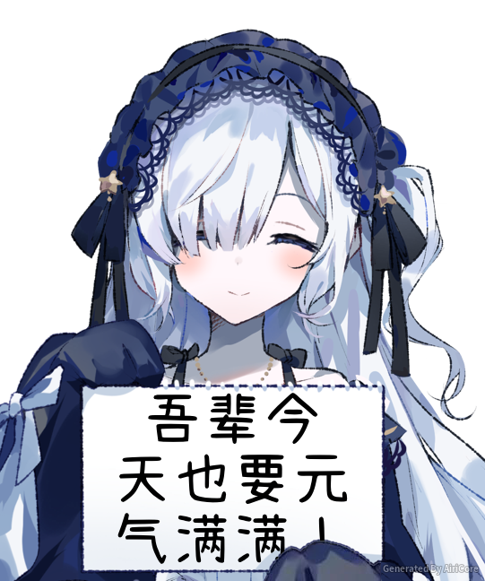
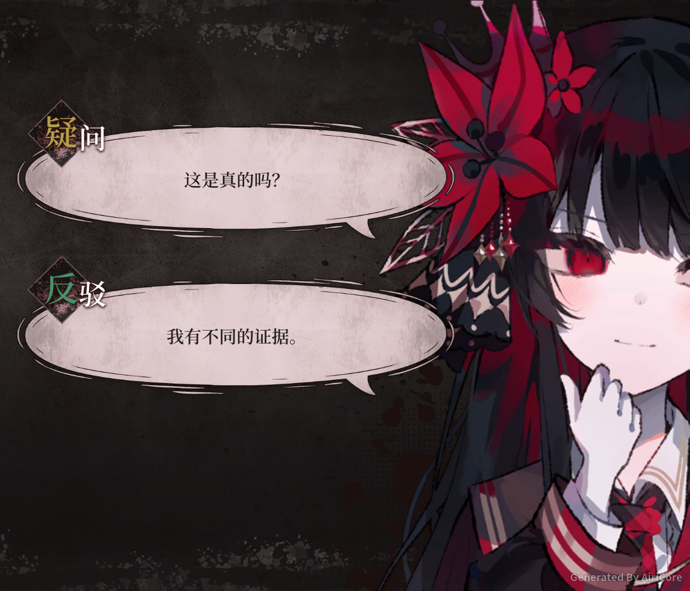
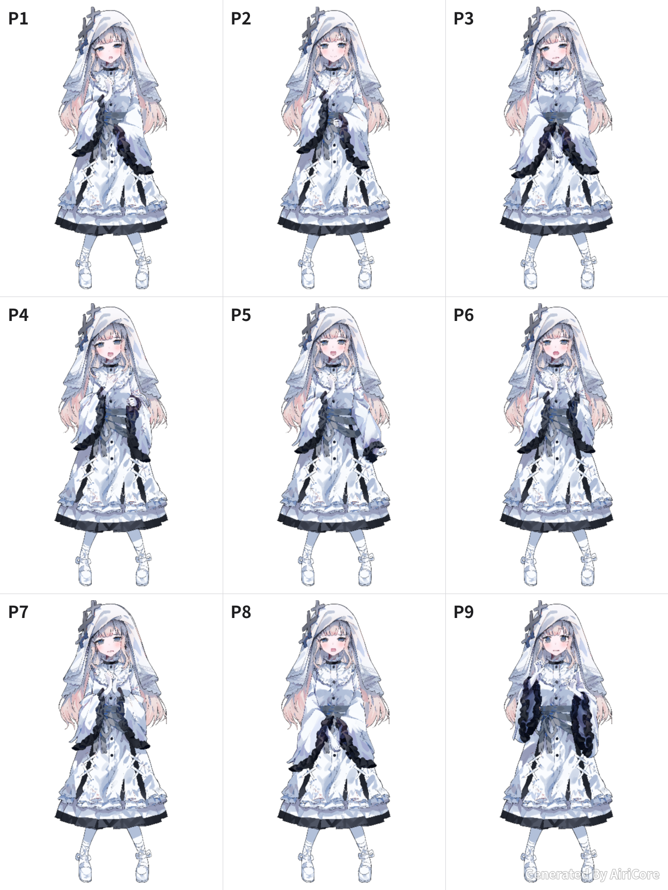
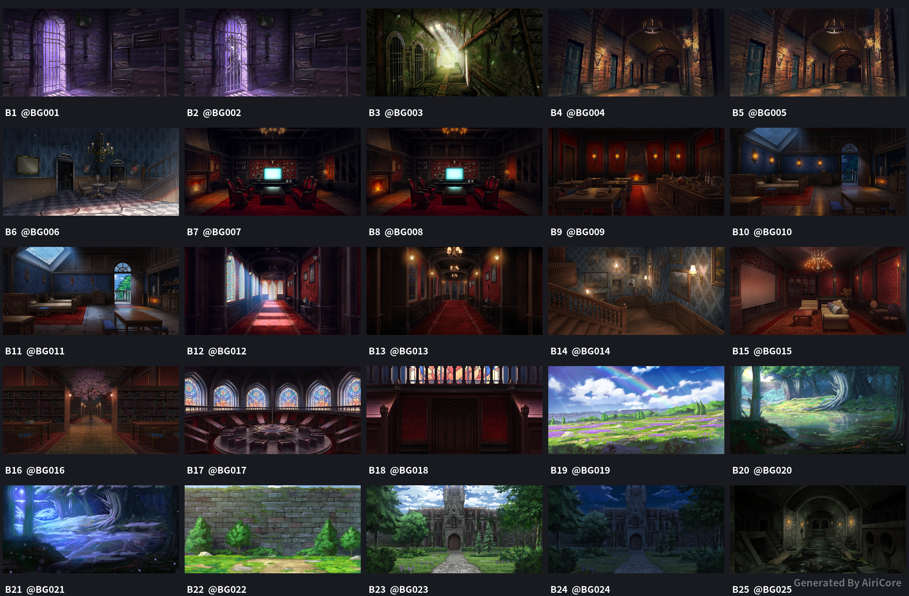
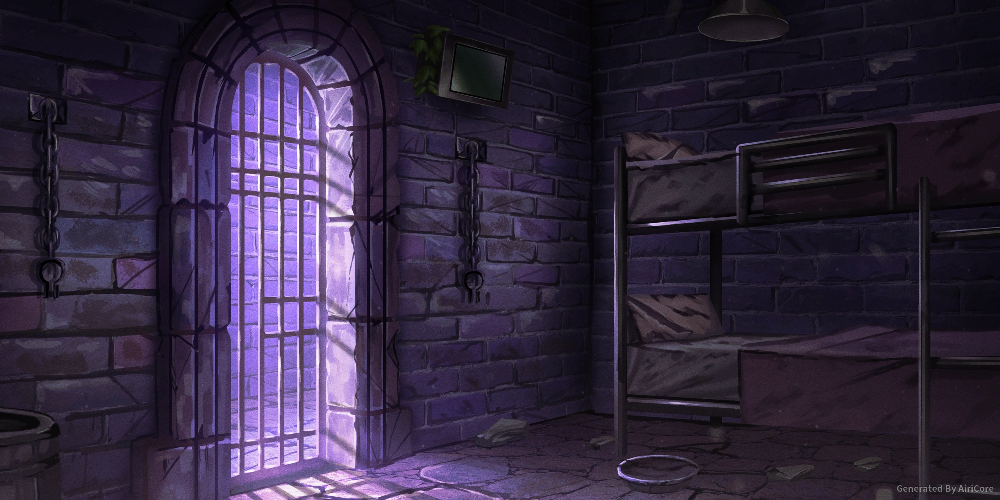
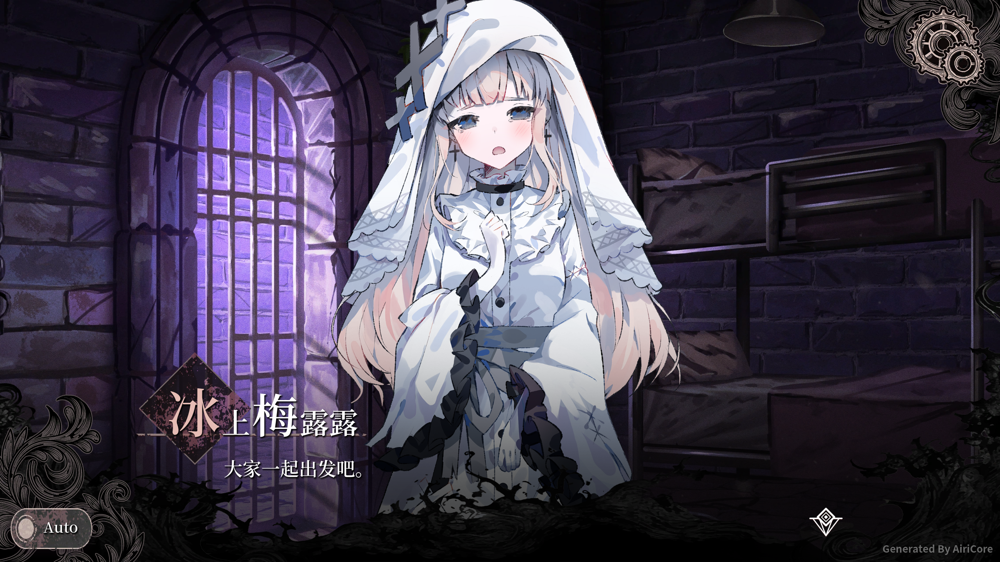
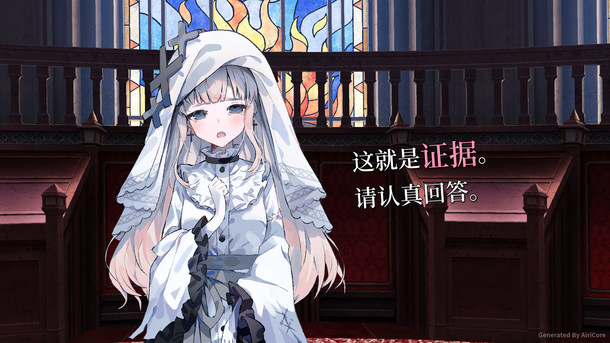
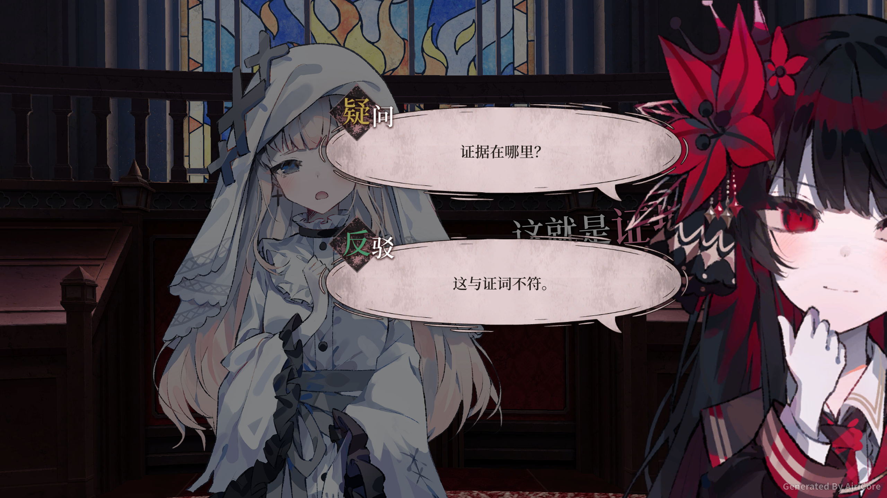

# AiriCore 魔裁DIY制作帮助

## 安安说

让安安举起写着指定文字的素描本。

```text
安安说 "吾辈今天也要元气满满！" 开心
```

- 格式：`安安说 文本 [表情]`，文本含空格时用引号包裹。
- 表情可选：害羞、生气、病娇、无语、开心；省略时使用默认表情。
- 正文支持 1～500 字，可用 `\n` 换行。



## 魔裁鸭梨

选择本次出场角色，把审判选项制作成游戏画面。**下面的内容需要放在同一条消息中发送。**

```text
魔裁鸭梨 希罗
【疑问】这是真的吗？
【反驳】我有不同的证据。
```

- 第一行是命令和角色名，后续每行一个选项，支持 1～6 个选项。
- 普通类型：`【疑问】`、`【反驳】`、`【伪证】`、`【赞同】`。
- 魔法类型：`【魔法:艾玛】使用魔法`，冒号也可以写成中文 `：`。
- 第一行的角色决定右侧人物；魔法标签中的角色只决定魔法类型。
- 每个选项正文支持 1～300 字。每次都须指定角色，无需事先切换。
- 发送 `魔裁鸭梨 -h` 查看文字帮助。



## 魔裁立绘

从官方预设中选取立绘，再通过回复图片调整表情、五官和动作。

```text
魔裁立绘 梅露露
```

先收到官方预设选择表，回复选择表发送 `P1` 生成第一套立绘。



以下是梅露露 `P1` 的完整立绘，也可以直接发送对应短码生成：

```text
#CFAMVMR9LZ
```


| 回复内容 | 用途 |
| --- | --- |
| 头型 / 表情 / 眼睛 / 嘴巴 / 手臂 / 细节 | 打开对应选择表 |
| P1 / H1 / E1 / I1 / M1 / A1 / D1 | 选择预设、头型、表情、眼睛、嘴巴、手臂或细节 |
| +脸红 / -脸红 / +汗 / -汗 | 添加或移除对应细节 |
| 上一页 / 下一页 | 翻阅当前选择表 |
| 配方 | 查看当前组合与立绘短码 |

编号跨页连续。回复旧图可继续编辑旧组合；也可发送 `#CFAMVMR9LZ 表情` 打开该短码的表情选择表。发送 `魔裁立绘 -h` 查看完整帮助。

## 魔裁背景

浏览背景并取得背景短码。背景短码以 `@BG` 开头，与立绘短码 `#` 区分。

```text
魔裁背景 场景 1
```

回复选择表发送 `B1` 查看对应大图和短码，发送 `上一页` 或 `下一页` 翻页，编号跨页连续。



分类可选 `场景`、`插图`、`特效`。省略分类和页码时从场景第一页开始；有短码时可以直接查看：

```text
魔裁背景 @BG001
```



## 魔裁对话

组合背景、立绘、官方姓名牌和正文，制作完整游戏对话画面。

```text
魔裁对话 @BG001 #CFAMVMR9LZ *梅露露 大家一起出发吧。
```



| 内容 | 写法与规则 |
| --- | --- |
| 背景 | 指定一个背景短码，例如 `@BG001` |
| 角色 | 0～3 个立绘短码，按短码出现顺序从左到右排列 |
| 官方姓名牌 | `*角色名`，与画面中的立绘独立 |
| 不显示姓名牌 | `*none`，省略姓名牌参数也不显示 |
| 未知姓名牌 | `*?`，显示“？？？” |
| 正文 | 直接输入文字，保留换行，排版后最多三行，过长会提示缩短 |

参数顺序可以任意排列，用空白分隔，不需要 `参数=值`。不传立绘短码时不渲染人物，背景、姓名牌和正文仍正常显示。

无人物、无姓名牌的旁白示例：

```text
魔裁对话 @BG001 *none 房间里空无一人。
```

正文要包含 `*`、`#`、`@` 开头的参数字样时，用引号包裹对应文字，或在符号前加反斜线转义。发送 `魔裁对话 -h` 查看文字帮助。

## 魔裁审问

使用原作法庭透视舞台、立绘和倾斜大字，制作审问画面。

```text
魔裁审问 #CFAMVMR9LZ -左
这就是**证据**。
请认真回答。
```

- 一个立绘短码加一个位置参数；`-左`、`-右` 指人物所在侧，文字显示在另一侧。
- 立绘短码、位置和文字可乱序，以空白分隔。
- `**文字**` 显示为原作粉色放大强调，可在多处使用；标记必须成对闭合。
- 正文最多八行，支持实际换行、`\n` 或 `<br>`；保留原作固定字号，不自动缩字，长行请手动分行。
- 正文中的位置或短码字样可用引号保护。发送 `魔裁审问 -h` 查看文字帮助。



回复生成的审问图，发送完整的鸭梨指令：

```text
魔裁鸭梨 希罗
【疑问】证据在哪里？
【反驳】这与证词不符。
```

原审问画面会覆盖50%透明黑色，鸭梨人物和选项去掉原背景，靠右等比放大至全高。制作叠加图收取一次10积分。回复记录保存最近4096张审问图，重启后仍可使用；没有匹配记录的回复按普通鸭梨图生成。



## 可用角色

梅露露、诺亚、汉娜、奈叶香、亚里沙、米莉亚、雪莉、艾玛、玛格、安安、可可、希罗、蕾雅、雪、典狱长、看守。

魔法标签仅支持具有对应魔法素材的角色；典狱长和看守没有可用的魔法标签。

## 积分消耗

查看帮助、立绘选择表和背景免费。安安说、魔裁鸭梨、立绘成图、魔裁对话及魔裁审问每次制作 **10 积分**；回复已有立绘继续编辑免费。发送失败会退还本次制作积分。

## 版权信息

- 《魔法少女的魔法审判》相关游戏素材归 Acacia、Re.AER 所有。
- Powered By AiriCore Dev. 原作者：github/zhaomaoniu
- 思源黑体与思源宋体遵循 SIL Open Font License 1.1。
