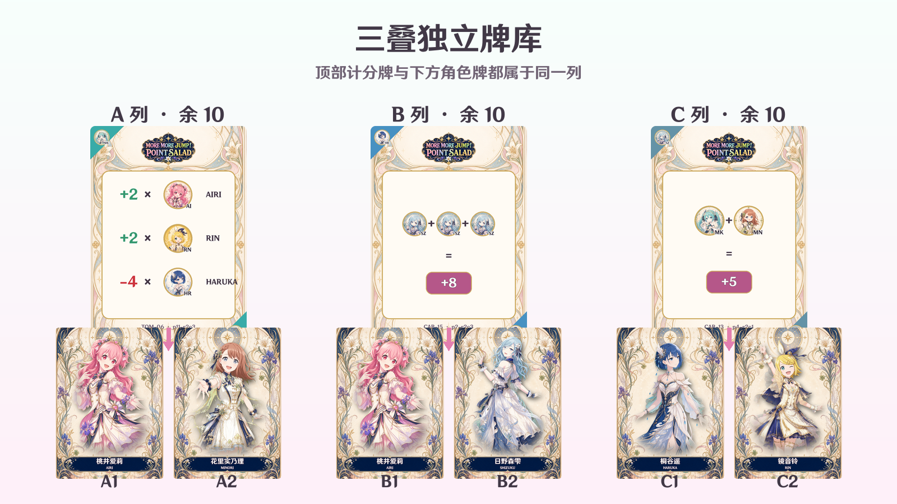
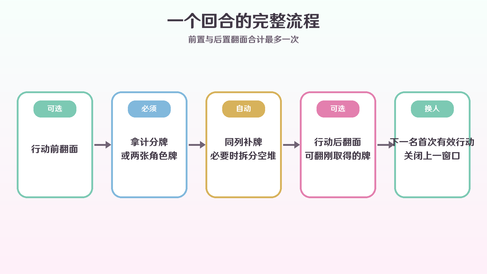
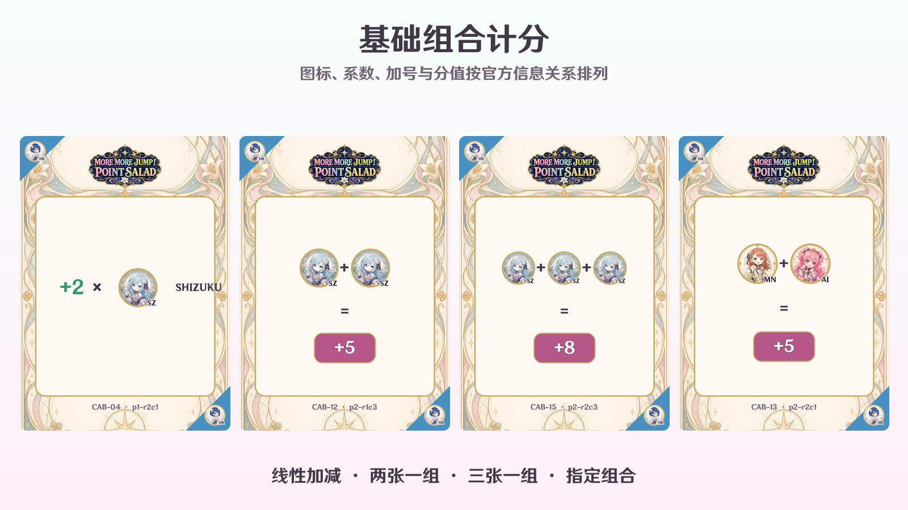
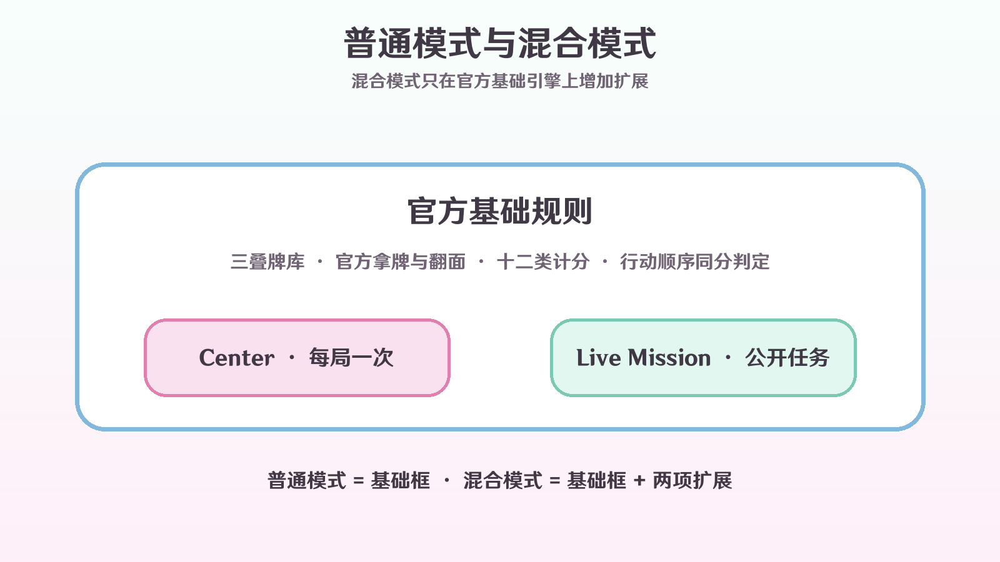
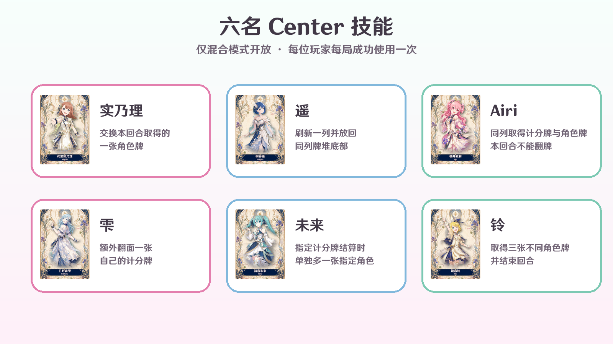

MORE MORE JUMP！得分沙拉是适合 2–6 人在群聊中游玩的 Point Salad 主题实现。卡牌保留 MORE MORE JUMP！角色主题，牌库、拿牌、翻面、计分和同分判定采用官方规则。


## 1. 普通模式与混合模式

- **普通模式**是官方基础游戏：三叠牌库、拿计分牌或角色牌、每回合一次翻面、官方 108 张卡牌与官方终局计分。
- **混合模式**完整保留普通模式，再加入本插件的 Center 技能和公开 Live Mission。
- **快速 / 标准**只调整抽入本局的牌量，不改变任何玩法规则。

第一次游玩推荐 `,sl cr qk cl`；熟悉后可用 `,sl cr std mx` 体验完整牌量与混合扩展。

## 2. 人数与牌量

每种角色都从对应的 18 张官方卡牌中等量随机抽取。快速局每种角色抽入“人数 × 2”张，标准局为“人数 × 3”张。

| 人数 | 快速每种 | 快速总数 | 标准每种 | 标准总数 |
| --- | ---: | ---: | ---: | ---: |
| 2 | 4 | 24 | 6 | 36 |
| 3 | 6 | 36 | 9 | 54 |
| 4 | 8 | 48 | 12 | 72 |
| 5 | 10 | 60 | 15 | 90 |
| 6 | 12 | 72 | 18 | 108 |

6 人标准局会使用完整 108 张官方卡牌。其他组合只是从官方卡组中按角色等量抽取，不会生成自定义计分条件。

## 3. 三叠牌库与市场坐标

洗好的牌平均分成三叠独立牌库。每列牌库顶部直接展示计分面；其下两张角色牌使用 `A1` 到 `C2` 坐标。



每个市场空位只从同列牌库补牌。若一叠清空，系统选择当前最大的牌堆，把它的下半部分移动到空列，原牌堆顶部保持不变；最大牌堆并列时优先选择较左一列。随后继续按同列补牌，直到能补的位置已补完或剩余牌不足以再次拆分。

## 4. 一个回合

轮到你时必须完成一项主行动：

1. 输入 `,sl ta A`，拿走 A 列顶部的一张计分牌。
2. 输入 `,sl ta A1 B2`，拿走两个不同位置的角色牌。

残局市场不足两张角色牌时，必须拿走全部剩余角色牌。主行动成功后自动同列补牌，并把当前玩家切换到下一位。



每回合最多把自己的一张计分牌永久翻成对应角色牌：

- **行动前**可以先输入 `,sl fl 2`，再完成主行动。
- **行动后**若本回合尚未翻牌，可以在下一名玩家首次有效行动前输入 `,sl fl 2`。
- 行动后可以翻本回合刚取得的计分牌。
- 下一名玩家成功翻牌、拿牌、准备技能或结算技能时，上一人的后置窗口关闭。
- 查看桌面、查看帮助、无效指令和失败操作不会关闭窗口。

翻成角色面后不能翻回，也不再提供原计分条件。

## 5. 十二类官方计分

同一张角色牌可以同时参与多张计分牌，不会被消耗。单张计分牌可以得到 0 分或负分。



十二类规则为：

1. **最多**：拥有指定角色最多的玩家得分；并列者都得分。
2. **最少**：拥有指定角色最少的玩家得分；0 张也参与比较，并列者都得分。
3. **奇偶**：指定角色为偶数或奇数时获得对应分数，0 视为偶数。
4. **线性加减**：按多个角色的正负系数逐项相加，结果可能为负。
5. **同角色两张**：每凑齐两张指定角色获得一次分数，余数不计。
6. **同角色三张**：每凑齐三张指定角色获得一次分数，余数不计。
7. **指定组合**：每凑齐牌面要求的两种或三种角色各一张，获得一次分数。
8. **缺少种类**：每缺少一种角色获得一次分数。
9. **达到数量的种类**：每一种达到牌面门槛的角色获得一次分数。
10. **角色总数最少**：角色牌总数最少的玩家得分；并列者都得分。
11. **角色总数最多**：角色牌总数最多的玩家得分；并列者都得分。
12. **完整六种套组**：每集齐六种角色各一张，获得一次分数。


## 6. 游戏结束与官方同分判定

三叠牌库与六个市场位置全部为空时，游戏立即结束。普通模式总分是所有未翻面的计分牌之和；混合模式再加上 Live Mission 分数。

排名先比较总分。若总分相同，最后完成主行动的行动顺序较晚者排名更高，因此最终名次不会并列。不再比较角色牌数量或完成的 Mission 数量。

## 7. 混合模式扩展

混合模式只在官方基础引擎上增加 Center 与 Live Mission，不改变三叠牌库、补牌、翻面和十二类计分。



每位玩家获得一名不重复 Center，技能每局只能成功使用一次：

- **实乃理**：`,sl sk` 准备，正常拿两张角色牌，再用 `,sl sk A1 C2` 放回本回合取得的一张并交换另一位置。
- **遥**：`,sl sk A` 移除 A 列顶部计分牌和两张市场牌，按稳定顺序放到 A 牌堆底部，再补充该列；技能本身不结束回合。
- **Airi**：`,sl sk` 准备，再用 `,sl ta A A1` 同时取得同列计分牌和角色牌；该回合不能翻牌。
- **雫**：`,sl sk 2` 额外把一张自己的计分牌翻成角色牌；之后仍需主行动。
- **未来**：`,sl sk 2 rin` 让指定计分牌结算时单独额外视为拥有一张铃。
- **铃**：`,sl sk A1 B2 C1` 取得三张不同角色牌并结束回合。



桌面最多公开两项 Live Mission。拿牌结束时按公开顺序检查，每回合最多领取一项；完成后立即补充新任务。任务可能要求同角色数量、不同角色种类、两组对子，或同回合同时取得计分牌与角色牌。

## 8. 完整指令表

所有指令必须以英文逗号 `,` 开头；中文、英文全称和缩写可以混用，英文不区分大小写。

| 功能 | 中文 / 英文 / 缩写 | 示例 |
| --- | --- | --- |
| 根命令 | `沙拉 / salad / sl` | `,sl` |
| 创建 | `创建 / create / cr` | `,sl cr qk cl` |
| 快速 | `快速 / quick / qk` | `,sl cr qk mx` |
| 标准 | `标准 / standard / std` | `,sl cr std cl` |
| 普通 | `原版 / classic / cl` | `,sl cr qk cl` |
| 混合 | `混合 / mix / mx` | `,sl cr std mx` |
| 加入 | `加入 / join / j` | `,sl j` |
| 退出 | `退出 / leave / lv` | `,sl lv` |
| 开始 | `开始 / start / st` | `,sl st` |
| 结束 | `结束 / stop / sp` | `,sl sp` |
| 拿牌 | `拿 / take / ta` | `,sl ta A` 或 `,sl ta A1 B2` |
| 翻牌 | `翻 / flip / fl` | `,sl fl 2` |
| 技能 | `技能 / skill / sk` | `,sl sk A` |
| 桌面 | `桌面 / board / bd` | `,sl bd` |
| 规则 | `规则 / rules / rl` | `,sl rl` |

## 9. 一局示例

```text
房主：,sl cr qk mx
其他玩家：,sl j
房主：,sl st
当前玩家：,sl ta A
当前玩家：,sl fl 1
下一位玩家：,sl ta A1 B2
查看桌面：,sl bd
查看规则：,sl rl
```

开局玩家由本局种子随机决定，未必是房主。Airi 只在新玩家回合开始时发送一次 `@玩家 + 桌面图片`；行动后的翻牌不会重复提醒下一位。

## 10. 常见问题、超时与版权

### 为什么不能开始？

至少需要 2 名玩家，且只有房主可以开始。房主在大厅退出后，身份会转交给仍在房间中的第一位玩家。

### 为什么翻牌失败？

每回合前置和后置翻牌合计最多一次。实乃理交换尚未完成时不能翻牌；Airi 技能生效的回合也不能翻牌。下一名玩家已经完成首次有效行动后，上一人的后置窗口也会关闭。

### 房间保留多久？

大厅连续 **15 分钟**没有有效操作会自动关闭；对局连续 **30 分钟**没有有效操作也会自动关闭。查看桌面和帮助不会刷新计时。

### 如何提前结束？

房主或群管理员可输入 `,sl sp`。输入 `,sl bd` 可随时查看当前桌面。

Point Salad 原作及 MORE MORE JUMP！、世界计划相关名称、角色与美术素材的权利归各自权利人所有。本插件为非官方同人实现，与原权利方无隶属或授权关系。AiriCore 代码采用 MIT License。
