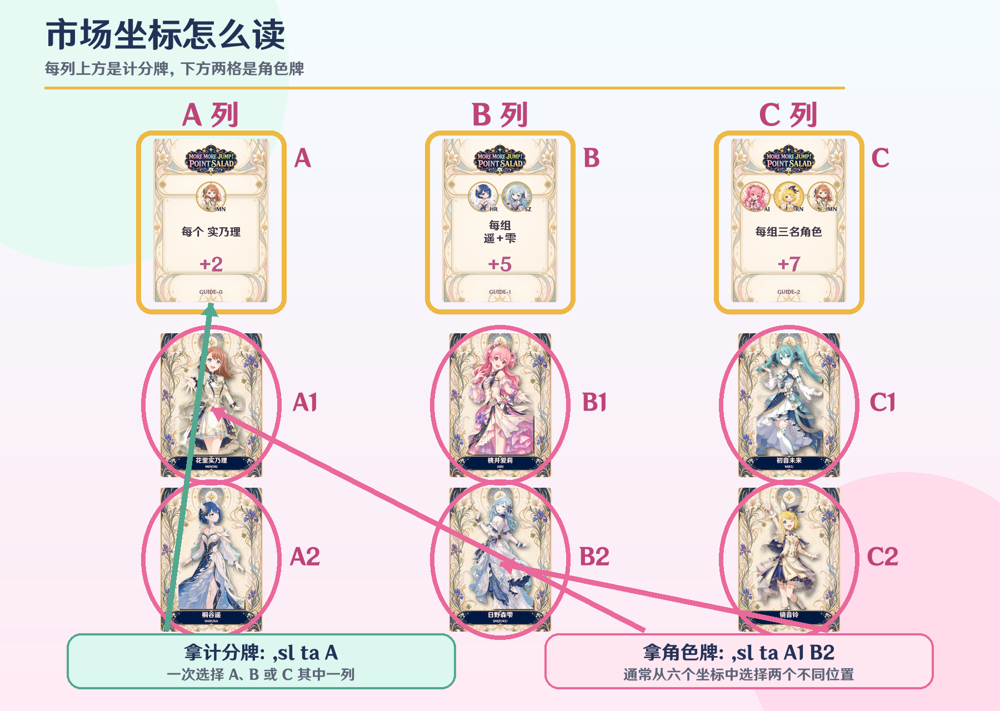
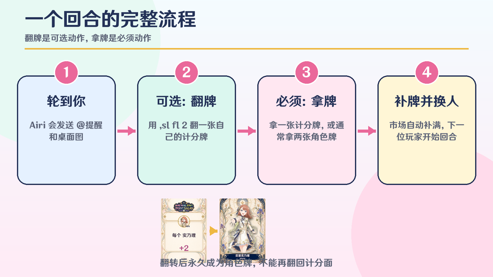
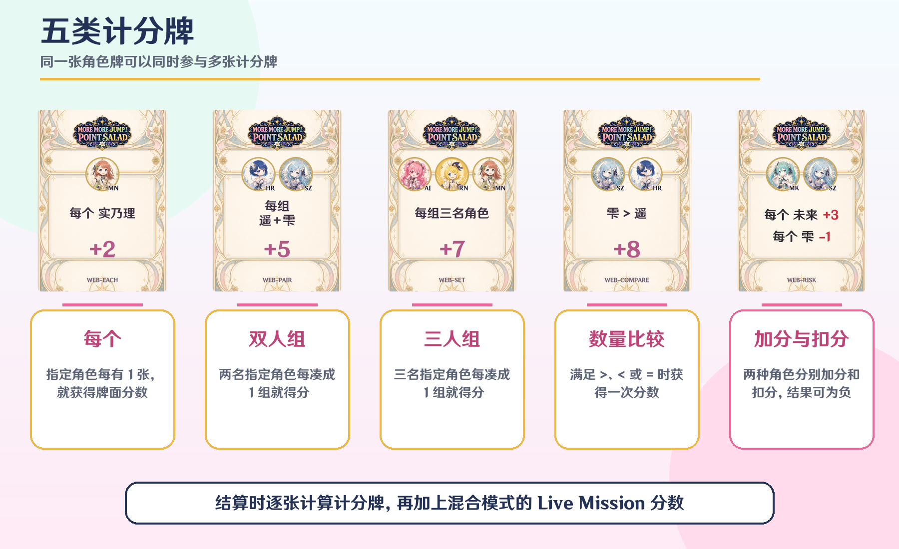
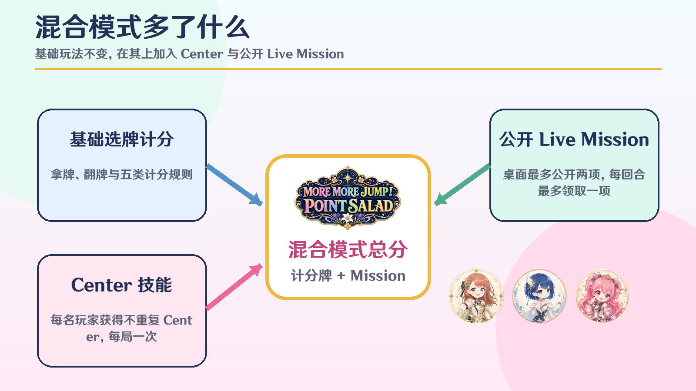
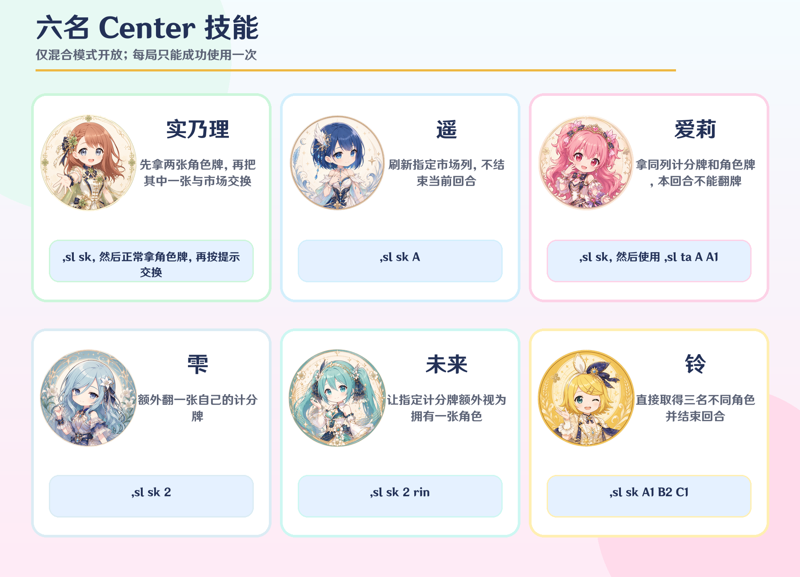

MORE MORE JUMP！得分沙拉是一款在群聊中进行的选牌与组合计分桌游。规则基于 Point Salad，并加入了 MORE MORE JUMP！主题角色、Center 技能与 Live Mission。

## 游戏目标

玩家轮流从市场取得角色牌或计分牌。角色牌提供不同角色的数量，计分牌则规定这些角色如何得分。牌库与市场全部清空后，每位玩家逐张结算自己的计分牌；混合模式还会加上已完成的 Live Mission 分数。

总分最高者获胜。得分之外，更重要的是观察市场、判断别人需要什么，并让自己取得的角色牌同时服务于多张计分牌。

## 开始之前

- 游戏仅支持群聊，每局需要 **2–6 人**。
- 房主创建房间后，其他玩家加入，再由房主开始。
- 快速局每位玩家对应 12 张牌，节奏较快。
- 标准局每位玩家对应 18 张牌，组合空间更大。
- 原版模式只使用基础选牌、翻牌和计分规则。
- 混合模式额外分配 Center，并启用公开 Live Mission。

常用创建方式：

| 组合 | 指令 |
| --- | --- |
| 快速原版 | `,sl cr qk cl` |
| 快速混合 | `,sl cr qk mx` |
| 标准原版 | `,sl cr std cl` |
| 标准混合 | `,sl cr std mx` |

## 市场与卡牌

每张牌都有两面：正面是角色牌，背面是计分牌。进入市场后，上方的三张计分牌用列名 `A`、`B`、`C` 表示；下方六张角色牌用 `A1` 到 `C2` 表示。



普通拿牌只有两种选择：

1. 输入 `,sl ta A`，拿走 A 列的一张计分牌。
2. 输入 `,sl ta A1 B2`，拿走两个不同位置的角色牌。

如果市场中只剩一张角色牌，则必须取得这张剩余角色牌；不能用普通拿牌指令同时取得计分牌和角色牌。拿牌结束后，Airi 会从牌库自动补满空位。

## 每回合怎么行动

轮到你时，Airi 会发送一条包含 `@玩家` 和桌面图片的提醒。一个普通回合按以下顺序进行：

1. **可选翻牌：**用 `,sl fl 2` 把自己编号为 2 的计分牌翻成角色牌。每回合最多翻 1 张，也可以完全不翻。
2. **必须拿牌：**选择一张计分牌，或通常选择两张不同位置的角色牌。
3. **补满市场：**拿牌成功后自动补牌，并轮到下一位玩家。



翻过的计分牌会永久成为它正面的角色牌，不能再翻回计分面，也不会在结算时继续提供计分条件。因此，翻牌是在“保留一条计分规则”和“增加一个角色数量”之间做取舍。

## 五类计分牌



### 每个

指定角色每有 1 张，就获得一次牌面分数。例如“每个实乃理 +2”，持有 4 张实乃理便获得 8 分。

### 双人组

两名指定角色每组成 1 组就得分，组数由较少的那名角色决定。例如遥有 3 张、雫有 2 张，则可以组成 2 组。

### 三人组

三名指定角色每组成 1 组就得分，组数由三者中数量最少的角色决定。

### 数量比较

比较两名指定角色的数量。满足牌面上的 `>`、`<` 或 `=` 时，获得一次牌面分数；不满足则为 0 分。

### 风险

一种角色按张加分，另一种角色按张扣分，两项相加得到这张计分牌的最终得分。风险牌可能得到负分。

同一张角色牌可以同时参与多张计分牌，不会因为已经用于一张计分牌而被消耗。

## 原版与混合模式

原版模式适合第一次游玩：只有拿牌、翻牌和五类计分规则。

混合模式保留全部原版规则，并加入两项变化：

- 每位玩家获得一名不重复的 Center，可以发动一次专属技能。
- 桌面公开最多两项 Live Mission，达成条件即可获得额外分数。



## 六名 Center 技能

Center 技能仅在混合模式中存在，每位玩家的技能每局只能成功使用一次，而且只能在自己的回合使用。



### 实乃理

实乃理的技能分三步完成：

1. 输入 `,sl sk` 准备技能。
2. 正常输入 `,sl ta A1 B2` 取得两张角色牌。
3. 输入 `,sl sk A1 C2`，把本回合从 A1 取得的牌放回 A1，再从仍有牌的 C2 取得一张新牌。

交换完成后回合才会结束。技能准备后不能改拿计分牌，也不能把待完成的交换留到下一回合。

### 遥

输入 `,sl sk A` 刷新 A 列的计分牌和角色牌。刷新本身不结束回合，之后仍需完成正常拿牌。

### 爱莉

先输入 `,sl sk`，再输入 `,sl ta A A1`，同时取得 A 列计分牌和同列 A1 角色牌。发动爱莉技能的回合不能翻牌；如果本回合已经翻过牌，也不能再准备这个技能。

### 雫

输入 `,sl sk 2`，把自己编号为 2 的计分牌额外翻成角色牌。这个技能不结束回合，因此之后仍需完成拿牌。

### 未来

输入 `,sl sk 2 rin`，选择自己编号为 2 的计分牌，并指定铃。结算这张计分牌时，会额外视为拥有 1 张铃；这张通配效果只作用于被指定的计分牌。

### 铃

输入 `,sl sk A1 B2 C1`，直接取得市场中三名不同角色的牌。三个位置必须各不相同，且对应三名不同角色；成功后立即结束回合。

## Live Mission

混合模式的桌面最多公开两项 Live Mission。任务可能要求：

- 拥有至少 3 张或 4 张同一角色；
- 拥有至少 3 名或 5 名不同角色；
- 拥有至少两组角色对子；
- 在同一个回合同时取得计分牌和角色牌。

拿牌结束时，系统会按公开顺序检查任务。每回合最多领取一项 Live Mission；领取后立刻补充新的公开任务。任务分数会在最终结算时加入计分牌总分。

## 游戏结束与排名

当牌库为空，而且市场中的计分牌和角色牌也全部被拿完时，游戏自动结束并结算。每位玩家的总分为：

**全部计分牌得分 + Live Mission 分数**

排名首先比较总分。总分相同时，依次比较角色牌总数和完成的 Mission 数量；三项完全相同则并列。

房主或群管理员也可以用 `,sl sp` 提前结束对局；此时会按当前持有的牌立即结算。

## 完整指令表

所有指令必须以英文逗号 `,` 开头。中文、英文全称和英文缩写可以混用，英文不区分大小写。

| 功能 | 中文 / 英文 / 缩写 | 示例 |
| --- | --- | --- |
| 根命令 | `沙拉 / salad / sl` | `,sl` |
| 创建 | `创建 / create / cr` | `,sl cr qk cl` |
| 快速 | `快速 / quick / qk` | `,sl cr qk mx` |
| 标准 | `标准 / standard / std` | `,sl cr std cl` |
| 原版 | `原版 / classic / cl` | `,sl cr qk cl` |
| 混合 | `混合 / mix / mx` | `,sl cr qk mx` |
| 加入 | `加入 / join / j` | `,sl j` |
| 退出 | `退出 / leave / lv` | `,sl lv` |
| 开始 | `开始 / start / st` | `,sl st` |
| 结束 | `结束 / stop / sp` | `,sl sp` |
| 拿牌 | `拿 / take / ta` | `,sl ta A` 或 `,sl ta A1 B2` |
| 翻牌 | `翻 / flip / fl` | `,sl fl 2` |
| 技能 | `技能 / skill / sk` | `,sl sk A` |
| 桌面 | `桌面 / board / bd` | `,sl bd` |
| 规则 | `规则 / rules / rl` | `,sl rl` |

一局快速混合模式可以这样开始：

```text
房主：,sl cr qk mx
其他玩家：,sl j
房主：,sl st
当前玩家：,sl fl 1
当前玩家：,sl ta A1 B2
下一位玩家：,sl sk A
下一位玩家：,sl ta C
查看桌面：,sl bd
提前结束：,sl sp
```

## 常见问题

### 为什么不能开始游戏？

至少需要 2 名玩家，且只有房主可以开始。房主在大厅退出后，房主身份会自动转交给仍在房间中的第一位玩家。

### 为什么我的拿牌指令被拒绝？

请先确认已经轮到你，并检查坐标是否还有牌。普通拿角色牌时必须选择当前要求数量的不同位置；角色牌充足时通常需要两张，市场只剩一张时则必须拿走这一张。

### 为什么不能翻牌？

每回合最多翻 1 张自己的计分牌。实乃理交换尚未完成时不能翻牌，爱莉技能生效的回合也不能翻牌。

### 房间会保留多久？

大厅连续 15 分钟没有合法操作会自动关闭；对局连续 30 分钟没有合法操作也会自动关闭。查看桌面或查看帮助不会刷新计时。

### 如何查看当前局面？

输入 `,sl bd`。轮到新玩家时，Airi 也会主动发送一条 `@玩家 + 桌面图片` 的提醒。

## 版权信息

AiriCore 采用 MIT License  
Copyright (C) 2026 AiriCore Dev.

Point Salad 原作及 MORE MORE JUMP！、世界计划相关名称、角色与美术素材的权利归各自权利人所有。本插件为非官方同人实现，与原权利方无隶属或授权关系。
